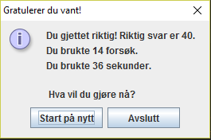



DAT113 --- Obligatorisk Oppgave 01
=======

Frist: Mandag 21. januar 23:59

I denne oppgaven skal du lage et "Gjett tallet"-spill i Java. 



-----------


(Obligatorisk) Deloppgave 1 
-----------
Lag et program som spør brukeren om et tall i en ```JOptionPane.showInputDialog```. Resultatet skal lagres som et tall (int). Brukeren skal få en beskjed i en ```JOptionPane.showMessageDialog``` om hvilket tall som ble skrevet inn.

<!--
Javafilen **må** ha navnet Assignment01 (filnavnet **må** være Assignment01.java).  
-->

(Obligatorisk) Deloppgave 2 
-----------
Gjør slik at programmet velger seg ut et tilfeldig tall mellom 0 og 100 og lagrer dette i en fornuftig variabel. Hvis brukeren skriver inn riktig tall skal han/hun få beskjed om at det var riktig tall. 

Hint: ```Math.random()```


(Obligatorisk) Deloppgave 3
----------- 
Gjør slik at programmet ditt spør brukeren etter et tall helt til riktig tall blir skrevet inn.


(Obligatorisk) Deloppgave 4
-----------
Utvid programmet til å gi brukeren et hint dersom han/hun ikke gjetter riktig. Altså skal brukeren få beskjed om at riktig tall er **høyere** dersom personen gjetter lavere enn det tallet programmet ditt har bestemt seg for, eller motsatt, at riktig tall er **lavere** om brukeren gjetter for høyt.

(Obligatorisk) Deloppgave 5
-----------
Når brukeren gjetter riktig skal det komme opp en liten infoskjerm som sier litt om hvor mange forsøk brukeren brukte. Når ruten lukkes skal programmet avsluttes.

(Obligatorisk) Deloppgave 6
-----------
Legg filene i en mappe som heter: Assignment01

Commit og push all koden til ditt git-repository. Pass på at alle filene er lastet opp. 
<!--
Kjør din branch i Bamboo. Hvis alt er grønt har du fått godkjent. Hvis du er usikker, spør i øvingstimene.

>Husk å legge til ```.idea``` til i .gitignore-filen FØR du commit'er koden din. 
-->
(Frivillig) Deloppgave 7
-----------
I den siste inforuten som dukker opp i deloppgave 5 skal det være to knapper: en som heter "Avslutt" som avslutter programmet og en som heter "Start på nytt" som starter programmet på nytt (velger et nytt, tilfeldig tall og resetter antall gjett-variabelen).

(Frivillig ekspertoppgave) Deloppgave 8
-----------
Ta tiden på hvor lang tid brukeren bruker på å gjette seg frem til riktig tall. Brukt tid skal vises til brukeren i infoskjermen som kommer når brukeren har gjettet riktig.

Hint: Les om ```System.currentTimeMillis()```

