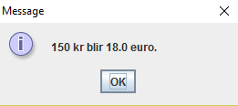



DAT113 --- Obligatorisk Oppgave 02
=======

Frist: Mandag 28. januar 23:59

I denne oppgaven skal du lage en valutakalkulator i Java. 



-----------


(Obligatorisk) Deloppgave 1 
-----------
Lag to java-klasser, en med main-metode (Runner-klassen) og en hjelpe-klasse som skal inneholde metodene vi skal lage.


(Obligatorisk) Deloppgave 2 
-----------
Gjør slik at Runner-klassen spør brukeren om antall kroner og lagrer dette i en fornuftig variabel. 


(Obligatorisk) Deloppgave 3
----------- 
I metode-klassen, lag en metode som tar inn kroner og gir tilbake euro. En krone er verdt 0.12 euro.

(Obligatorisk) Deloppgave 4
-----------
Oppdater programmet slik at runner-klassen bruker metoden du nettopp lagde til å finne ut av hvor mange euro det blir ut av de antall kroner som brukeren skrev inn. Resultatet skal vises tilbake til brukeren i en dialog. Altså skal du sende det brukeren skrev inn i metoden og ta imot det metoden returnerer og lagre det i en fornuftig variabel, og deretter vise det tilbake til brukeren.


(Obligatorisk) Deloppgave 5
-----------
I metode-klassen, lag en ny metode som tar inn kroner og returnerer yen. En krone er verdt 17 yen.

(Obligatorisk) Deloppgave 6
-----------
Bruk den nylig lagde funksjonen til å konvertere antall kroner brukeren skrev inn til yen. Lagre resultatet i en fornuftig variabel. Vis deretter resultatet til brukeren i en ny ```JOptionPane.showMessageDialog```.

Du skal altså:
- Spørre brukeren om antall kroner.
- Regne ut hvor mange euro det blir og lagre dette i en variabel.
- Regne ut hvor mange yen det blir og lagre dette i en annen variabel.
- Vise brukeren hvor mange euro det ble i en dialogboks.
- Vise brukeren hvor mange yen det ble i en annen dialogboks.


(Obligatorisk) Deloppgave 7
-----------
Gjør slik at brukeren kan velge hva det han skriver inn skal konverteres til, ved hjelp av f.eks. en ```JOptionPane.showOptionDialog```.


(Obligatorisk) Deloppgave 8
-----------
Commit og push all koden til ditt git-repository. Pass på at alle filene er lastet opp. 

(Frivillig) Deloppgave 9
-----------
Gjør slik at programmet ditt tar hensyn til om brukeren skriver inn noen ugyldige verdier, eks tekst (ikke tall). Brukeren skal da få beskjed om å skrive inn noe som er gyldig og muligheten til å skrive inn noe nytt.


(Frivillig) Deloppgave 10
-----------
Gjør slik at brukeren kan velge både hva det skal konverteres fra og hva det skal konverteres til. Finn en måte som du mener at er intuitiv for brukeren. Brukeren bør også kunne konvertere nye summer helt til han gir beskjed om at han er ferdig (trykker "avslutt", e.l.).


(Frivillig) Deloppgave 11
-----------
Gjør det slik at brukeren selv kan skrive inn kursen som skal brukes og at konverterings-funksjonen bruker den kursen som brukeren har valgt.


