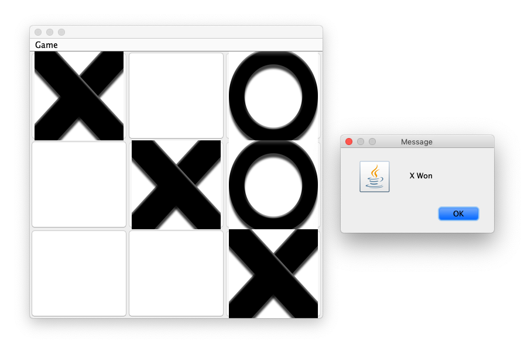
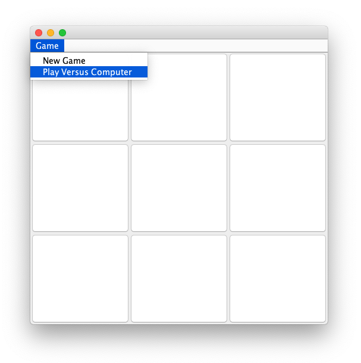



DAT113 --- Obligatorisk Oppgave 03
=======

**Frist: Mandag 11. februar 23:59**

I denne oppgaven skal du lage et tic-tac-toe spill i Java. 



-----------

(Obligatorisk) Deloppgave 1 
-----------
Lag en klasse  som skal kjøre programmet ditt.

Lag deretter en klasse  med GUI som et 3x3 tic tac toe brett. Se eksempel i Figur 1. Alle rutene skal være ```JButton```'s som brukeren kan trykke på. Alle knappene bør legges i en liste (eks en ```ArrayList<JButton>```) så man senere kan iterere over dem.

Tips: Vurder ```GridLayout``` som layout til JFrame'n. 

(Obligatorisk) Deloppgave 2
-----------
Gjør slik at om brukeren trykker på en av knappene så blir teksten i knappen satt til ```X```.

(Obligatorisk) Deloppgave 3
-----------
Legg til en meny med følgende valg: ```Game --> New Game```.




(Obligatorisk) Deloppgave 4
----------- 
Gjør slik at om brukeren trykker på ```New Game``` så fjernes alle X'ene fra knappene.

(Obligatorisk) Deloppgave 5
-----------
Gjør slik at når brukeren trykker på en knapp så blir teksten i knappen X, og neste gang brukeren trykker på en knapp blir teksten i knappen satt til ```O```.

(Obligatorisk) Deloppgave 6
-----------
Gjør slik at når en knapp har blitt trykt på så kan den ikke bli trykt på igjen. Oppdater ```New Game```-menyvalget slik at alle knappene blir mulig å trykke på igjen.

(Obligatorisk) Deloppgave 7
-----------
Gjør slik at etter brukeren har trykt på en knapp, så sjekkes det om en rad har 3 like.

(Obligatorisk) Deloppgave 8
-----------
Utvid funksjonen til å sjekke kolonner og diagonaler. Legg til en ```JOptionPane.showMessageDialog``` som sier om X eller O vant.

(Obligatorisk) Deloppgave 9
-----------
Legg til et menyvalg der brukeren kan velge mellom å spille mot datamaskinen.

(Obligatorisk) Deloppgave 10
-----------
Lag en funksjon som spiller på en tilfeldig valgt, gyldig knapp. Bruk denne når brukeren trykker på datamaskin menyvalget.

(Obligatorisk) Deloppgave 11
-----------
Vedlagt ligger to PNG-bilder av en X og en O. Bruk disse på knappene istedet for tekst (Hint: les om ```ImageIcon```).

(Obligatorisk) Deloppgave 12
-----------
Legg filene i en mappe som heter: Assignment03

Commit og push all koden til ditt git-repository. Pass på at alle filene er lastet opp. Obligen må godkjennes i labben.

>Husk å legge til ```.idea``` til i .gitignore-filen FØR du commit'er koden din. 

(Frivillig) Deloppgave 13
-----------
Utvid datamaskinen slik at hvis brukeren har to på rad, så trykker datamaskinen slik at den blokkerer fra å få 3 på rad. Om datamaskinen har mulighet til å få 3 på rad vil den alltid velge dette. Ellers så spiller den tilfeldig som vanlig.

