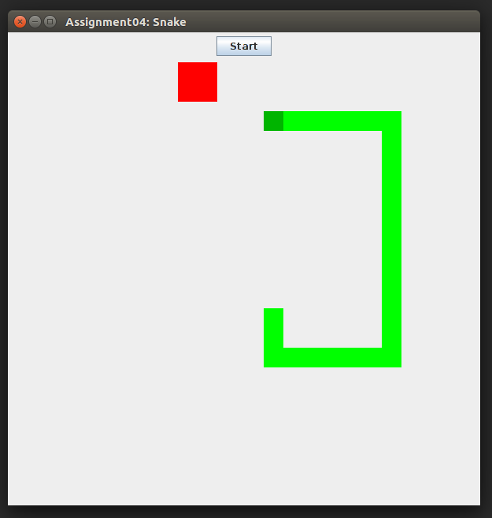



DAT113 --- Obligatorisk Oppgave 04
=======

Frist: Søndag 18. mars 23:59

I denne oppgaven skal du lage spillet "snake" i Java. Her er et løsningsforslag:



-----------


(Obligatorisk) Deloppgave 1 
-----------
Lag en runner-klasse og en klasse til GUI'et. GUI-klassen skal ta imot hendelser fra tastaturet. Sett enn passende tittel til vinduet og gjør andre passende forberedelser (størrelse, plassering, closeOperation, etc). Instansier GUI fra runner-klassen.


(Obligatorisk) Deloppgave 2 
-----------
Gjør slik at programmet skriver ut hvilken pil på tastaturet brukeren trykker på, oppoverpil, nedoverpil, høyrepil, venstrepil.

>Hint: bruk ```System.out.println```, istedenfor ```JOptionPane```, dette gjør det enklere å kjøre programmet.


(Obligatorisk) Deloppgave 3
----------- 
Lag en generell superklasse til å representere grafikk i programmet ditt (eks `BaseGraphic`). Denne bør ta vare på fornuftige vaiabler/egenskaper som hører til objekter som skal tegnes, for eksempel størrelse, farge og plassering.


(Obligatorisk) Deloppgave 4
-----------
Lag en ny klasse til å representere et snake-element. Tenk hvordan du best bruker arv. (ikke tenk så mye på hvordan snake'n skal bli større enda, dette kommer i deloppgave 9)

Lag et objekt av klassen og vis elementet i vinduet. 


(Obligatorisk) Deloppgave 5
-----------
Gjør slik at elementet flytter seg i vinduet tilsvarende den piltasten brukeren trykket på. For å få dette til må opptegningen av alle elementene i vinduet skje på nytt hver gang brukeren trykker på en tast på tastaturet.

>Frivillig: Les om `enum` i Java og finn ut hvordan du kan bruke dette til å ta vare på informasjon om hvilken retning snake'n går i.


(Obligatorisk) Deloppgave 6
-----------
Lag en ny klasse til å representere eplet. Denne skal også arve fra den superklassen fra deloppgave 3. Lag et nytt objekt av denne klassen og sørg for at den også blir tegnet opp på skjermen.

(Obligatorisk) Deloppgave 7
-----------
Gjør slik at eplet flytter seg med jevne mellomrom. 

>Hint: Bruk ```Timer``` og ```ActionListener```.


(Obligatorisk) Deloppgave 8
-----------
Gjør slik at hvis snake-elementet kolliderer med eple-elementet så skal det printes til consollen **Snake spiste eplet**. Altså må det sjekkes for kollisjon mellom to rektangler: eplet og snake-elementet (Bruk koden under som inspirasjon).

```java=
// In the BaseGraphic class:
...
/**
 * Returns true if the elements intersects, false otherwise.
 */
public boolean intersectsWith(BaseGraphic other) {
    Rectangle r1 = new Rectangle(this.posX, this.posY, this.width, this.height);
    Rectangle r2 = new Rectangle(other.getPosX(), other.getPosY(), other.getWidth(), other.getHeight());
    return r1.intersects(r2);
}
...

// Can be used by calling:
apple.intesectsWith(snakeHead);
```


(Obligatorisk) Deloppgave 9
-----------
Gjør slik at slangen blir lengre for hver gang den spiser et eple. 

>Hint: Bruk en ```ArrayList<Assignment04SnakeElement>``` til å representere snake'n.

Hint: Trikset er å flytte snake'n i riktig rekkefølge. Lag en metode for å flytte alle elementene i ```ArrayList```'n på følgende måte:
1) Flytt alle elementene av kroppen et steg frem (flytt elementet til samme posisjon som neste element).
2) Flytt hodet i riktig retning. 

Bruk følgende kode som inspirasjon:

```java=
...
private ArrayList<SnakeElement> snake = new ArrayList<>();
...

// Move snake body:
for (int i = 0; i < snake.size()-1; i++){
    snake.get(i).setPosX(snake.get(i+1).getPosX());
    snake.get(i).setPosY(snake.get(i+1).getPosY());
}
// Then, move snake head
```


(Obligatorisk) Deloppgave 10
-----------
Gjør slik at slangen flytter seg automatisk. Den bør da flytte seg i den retningen som brukeren trykket sist. 


(Obligatorisk) Deloppgave 11
-----------
Dersom slangen kommer på utsiden av vinduet skal den dø, og spilleren må starte spillet på nytt.


(Obligatorisk) Deloppgave 12
-----------
Legg filene i en mappe som heter: Assignment04

Commit og push all koden til ditt git-repository. Pass på at alle filene er lastet opp. Oppgaven må godkjennes manuelt i øvingstimen. Den kan godkjennes i labben uken etter fristen, men koden MÅ være lastet opp til bitbucket innen fristen.

>Husk å legge til ```.idea``` til i .gitignore-filen FØR du commit'er koden din. 


(Frivillig) Deloppgave 13
-----------
Gjør slik at slangen dør dersom den går over seg selv.


(Frivillig) Deloppgave 14
-----------
Oppdater slik at du får en poengsum og highscore.


(Frivillig, ekspertoppgave) Deloppgave 15
-----------
Gjør slik at highscore'n lagres i en fil og lastes inn på nytt for hvert nytt spill. Dersom det blir en ny highscore skal denne nye verdien lagres i fila.
>Hint: Les om serialisering.


